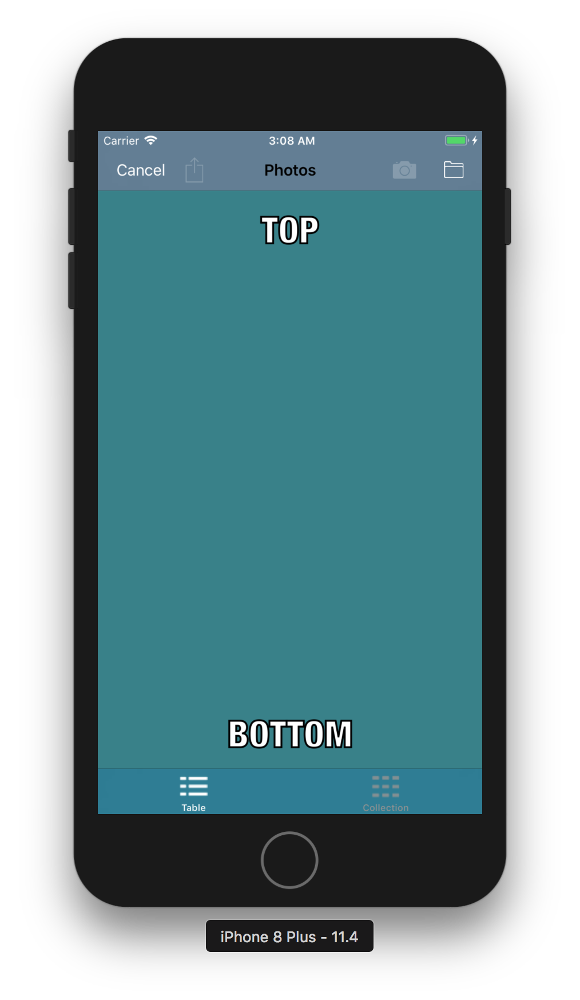
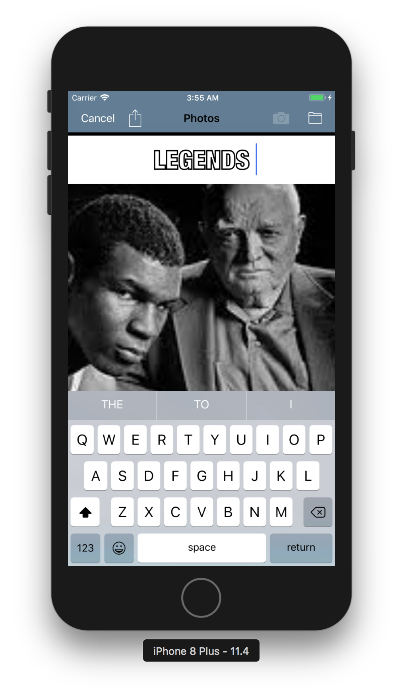
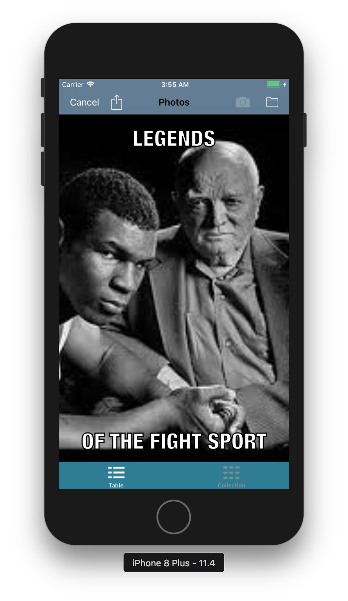
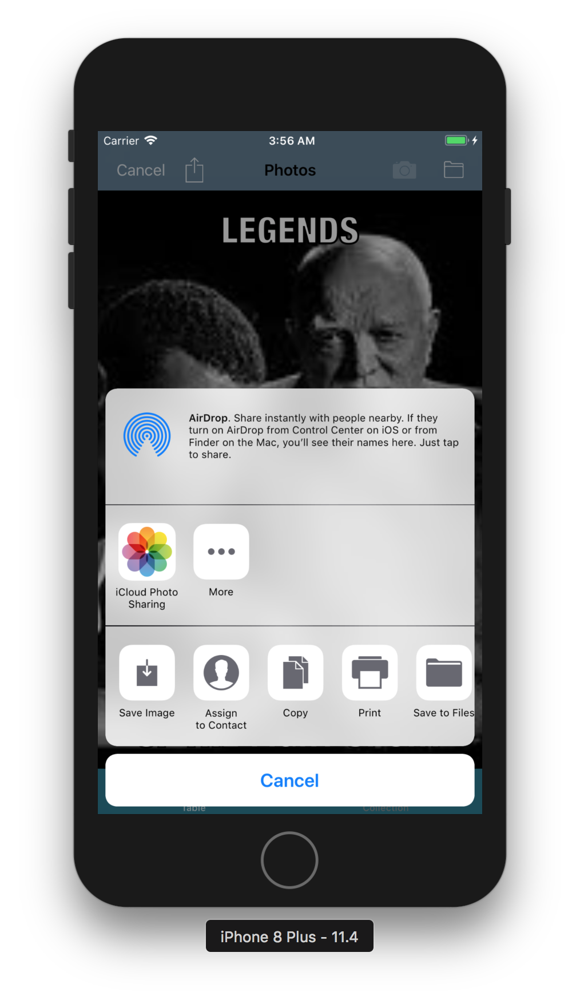
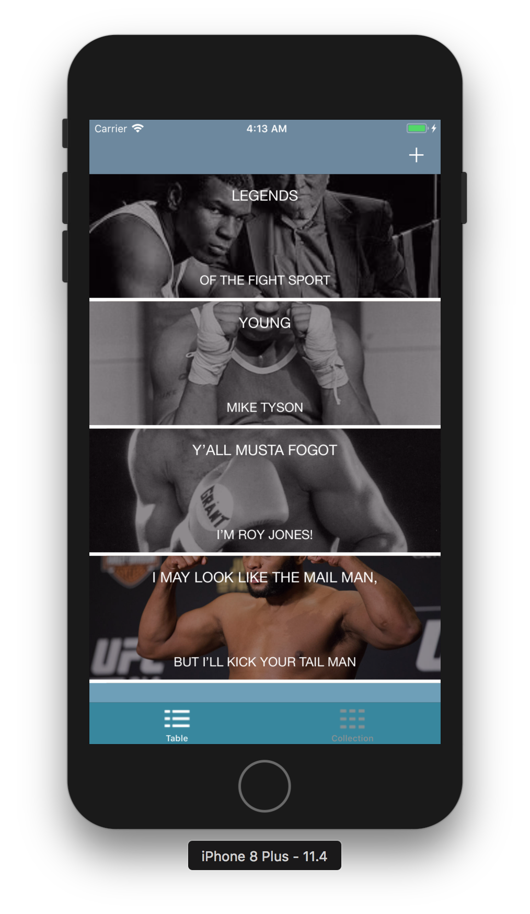
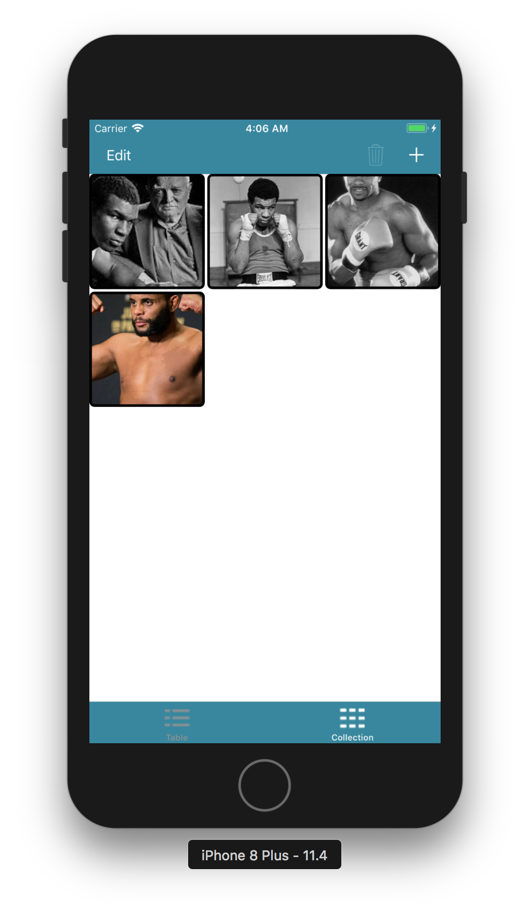

#  TrippNmemes
Licensing information: Read License

Author and Contributors List
------
Norbert Grover

All discovered bugs can be forewarded to sosagrover1987@gmail.com

Project Repository is at:
------
https://github.com/Pac12Run8000/TrippNmemes

How to use TrippNmemes meme generator
======
1. When you start up the application, you will see a tableView. If you go all the way to the bottom, you can see the tabs of a tabbar controller. You can select either a collectionView or a tableView. 

2. Click on the plus button in the upper right corner. 
3. You will get a blank screen with the text that reads "TOP" at the top and "BOTTOM" at the bottom.

4. Click on the text on either the top or bottom and type in what you want the meme text to say. 
5. Click on the directory or camera icon in the top right corner and select a photo for your meme. 
6. Select an action and the photo will be saved where you designated as well as the meme being persisted in the app.

7. The will then return you to the tableView with a new meme in the top cell.  
8. At this point, if you want to delete the meme, you can swipe left. Or if you have selected the collectionView tab, you can select edit and then designate the items that you want to delete and then press delete.

