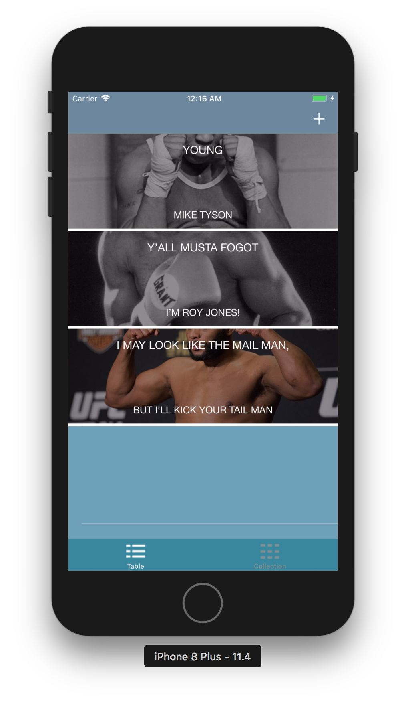
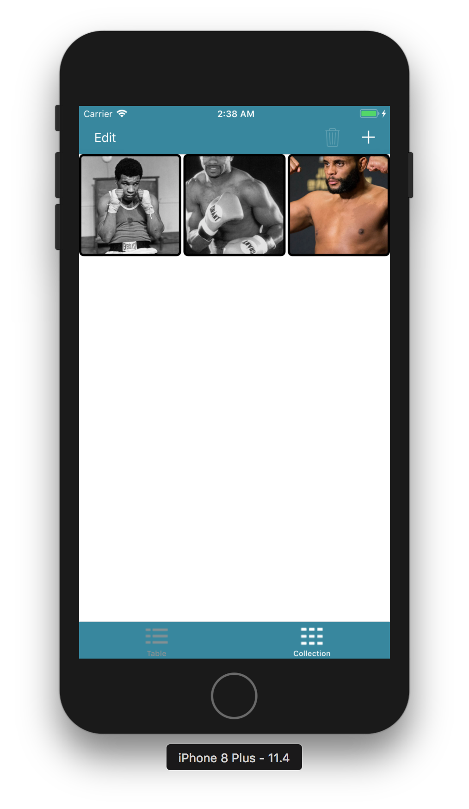

#  TrippNmemes
Licensing information: Read License

Author and Contributors List
------
Norbert Grover

All discovered bugs can be forewarded to sosagrover1987@gmail.com

Project Repository is at:
------
https://github.com/Pac12Run8000/TrippNmemes

How to use TrippNmemes meme generator
======
1. When you start up the application, you will see a tableView. If you go all the way to the bottom, you can see the tabs of a tabbar controller. You can select either a collectionView or a tableView. 

2. Click on the plus button in the upper right corner.
3. You will get a blank screen with the text that reads "TOP" at the top and "BOTTOM" at the bottom.

